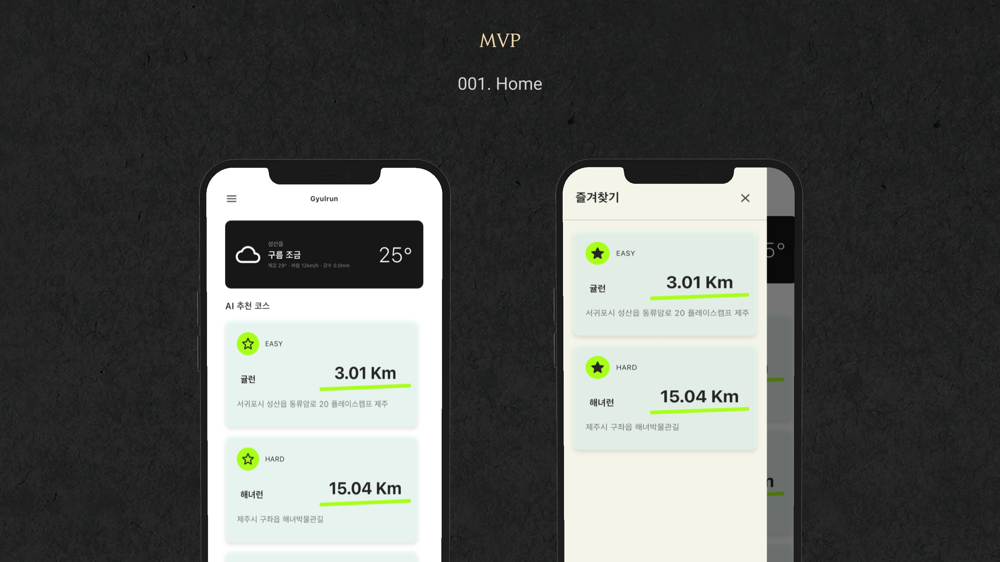
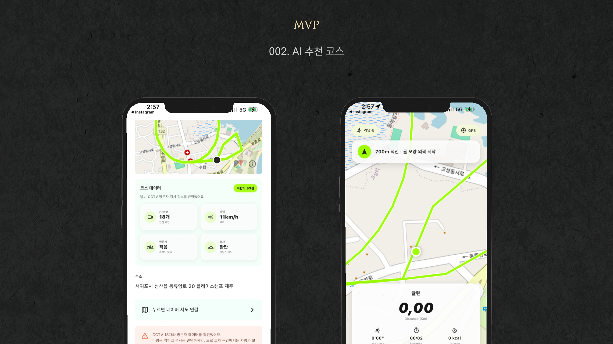
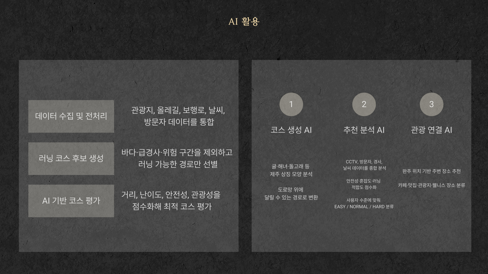
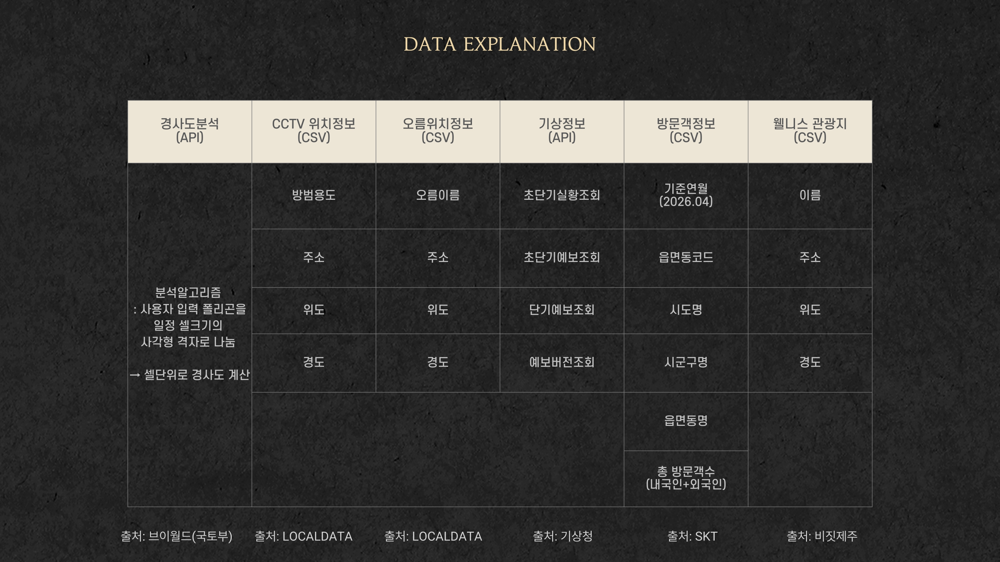

# Gyul Run

<p align="center">
  
</p>

AI 기반 제주 웰니스 러닝 플랫폼, **Gyul Run**입니다.  
사용자의 위치, 러닝 거리, 난이도, 선호도를 바탕으로 제주를 상징하는 모양의 러닝 코스를 추천하고, 완주 후에는 기록 카드와 주변 장소 추천을 제공하는 서비스입니다.

---

# 프로젝트 소개

현대인의 신체 활동량은 감소하고 있으며, 특히 여행 중에는 평소 유지하던 운동 습관이 쉽게 끊어집니다.

제주도는 해안도로, 오름, 올레길 등 러닝에 적합한 자연환경을 가지고 있지만, 관광객이 낯선 지역에서 안전하고 재미있는 러닝 코스를 찾기는 어렵습니다.

**Gyul Run**은 이러한 문제를 해결하기 위해, 제주 상징 모양의 러닝 코스를 제공하고 러닝 경험을 관광·웰니스 콘텐츠로 확장하는 모바일 앱입니다.

---

# 주요 화면

## Home

<p align="center">
  
</p>

- 현재 날씨 확인
- AI 추천 코스 제공
- 즐겨찾기 관리
- 자유 러닝 시작

---

## AI 추천 코스

<p align="center">
  
</p>

- 제주 상징 모양의 러닝 코스 생성
- CCTV, 경사도, 방문자, 날씨 등을 반영한 안전성 분석
- EASY / NORMAL / HARD 난이도 제공
- 실시간 러닝 가이드

---

## Running History

<p align="center">
  
</p>

- 완주 기록 저장
- 완주 카드 생성
- 별점 및 사진 기록
- 주변 관광지 추천

---

# 핵심 기능

### AI 추천 코스

- 귤런, 해녀런, 돌고래런 등 제주 상징 모양의 러닝 코스 제공
- 거리, 난이도, 경사, 날씨, 방문자 정보 등을 고려한 코스 추천
- EASY / NORMAL / HARD 난이도 분류

### 코스 상세 정보

- 지도 기반 러닝 경로 제공
- CCTV, 바람, 방문자, 경사 데이터 제공
- 안전 주의사항 안내
- 네이버 지도 연결

### 러닝 기록

- 추천 코스 러닝
- 자유 러닝
- 거리 / 시간 / 페이스 / 칼로리 기록
- 완주 후 사진 및 별점 저장

### 히스토리

- 러닝 기록 카드 저장
- 주변 장소 추천
- 완주 카드 이미지 저장 및 공유

---

# AI 활용

<p align="center">
  
</p>

Gyul Run은 단순한 경로 안내가 아닌 다양한 데이터를 종합하여 최적의 러닝 코스를 생성합니다.

- 제주 상징 모양 분석
- 도로망 기반 러닝 가능 경로 생성
- 사용자 거리 및 난이도 기반 추천
- CCTV, 날씨, 경사도, 방문자 데이터를 활용한 안전성 평가
- 완주 위치 기반 주변 관광지 추천

---

# 데이터 활용

<p align="center">
  
</p>

사용 데이터

- 경사도 데이터
- CCTV 위치 정보
- 오름 위치 정보
- 기상 정보
- 방문자 정보
- 웰니스 관광지 정보
- 보행로 데이터

---

# 기대 효과

- 여행 중에도 운동 습관을 이어갈 수 있는 웰니스 경험 제공
- 제주 자연환경과 러닝을 결합한 새로운 관광 콘텐츠
- 러닝 종료 후 주변 상권 추천을 통한 지역 경제 활성화
- SNS 공유 가능한 러닝 카드 제공

---

# 기술 스택

- Flutter
- Dart
- Flutter Map
- Geolocator
- Image Picker
- URL Launcher

---

# 실행 방법

```bash
flutter pub get
flutter run
```
